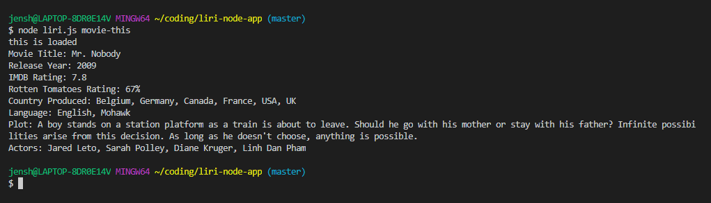

<!-- [Google](http://www.google.com/)

 -->

Overview:
This is an app that allows users to search for movies, concerts, and/or music by selecting commands from a list and then typing in a search term. This program runs only in the CLI (like Bash).

The app is broken down by individual function by specific command entered: movie-this, spotify-this-song, concert-this and do-what-it-says.  

The following must be installed on your machine:
•Git Bash
•NodeJS
•NPM
•MomentJS
•Node-Spotify-API
•Axios
•OMDB API
•Bands In Town API

Installing dependencies:
Use NPM to install all required dependencies:
npm install

Running the app: 
Use the following command to start the app:  node liri.js

Screen prints:

Concert This: 

Do What It Says: 

Movie This - Movie Entered:

Movie This - No Movie Entered: 

Spotify This Song - No Song Entered:

Spotify This Song - Song Entered:
 
